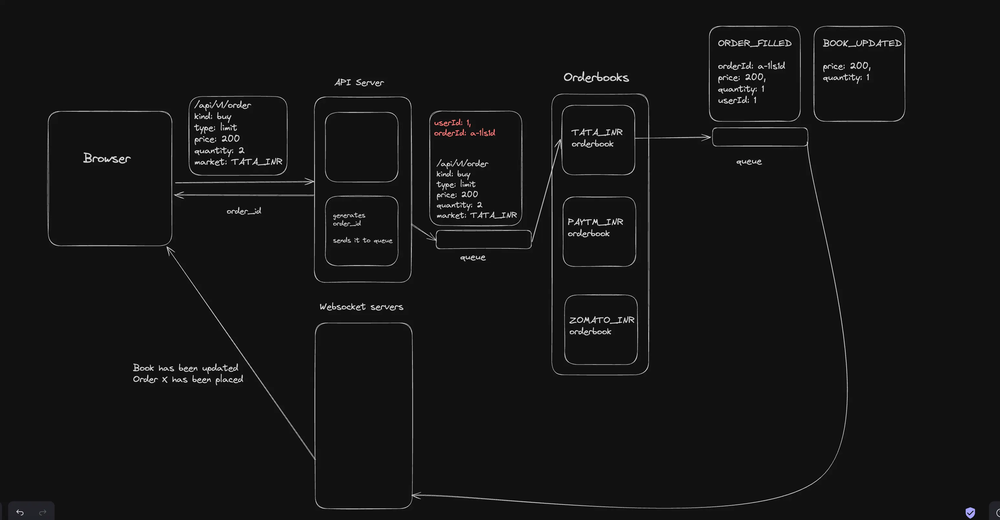

# TradeSphere

## What it is
A real-time trading system with an in-memory order book and matching engine.

## Key Features
- Order book + matching engine
- WebSocket real-time updates
- Redis-based async processing

---

## What it does

TradeSphere lets users trade assets (e.g. `TATA_INR`) through a full order-matching pipeline: place limit/market orders via REST, watch the orderbook update live via WebSocket, see price history as candlestick charts, and have every trade written to a time-series database.

---

## Architecture



```
                         ┌──────────────┐
                         │   Frontend   │ (Next.js :3000)
                         │   (Next.js)  │
                         └──────┬───────┘
                                │ REST + WebSocket
               ┌────────────────┴───────────────┐
               ▼                                ▼
      ┌─────────────────┐            ┌──────────────────┐
      │   API Server    │            │  WebSocket Server │
      │  (Express :3000)│            │   (ws lib :3001)  │
      └────────┬────────┘            └────────┬──────────┘
               │                              │
               │  Redis Queue                 │  Redis Pub/Sub
               │  "messages"                  │  depth@, trade@, ticker@
               ▼                              ▼
      ┌─────────────────────────────────────────────────┐
      │                    Engine                        │
      │       (single-threaded order matching)           │
      │  - Orderbook (bids/asks in-memory)               │
      │  - User balances (in-memory)                     │
      │  - Snapshots every 3s for crash recovery         │
      └────────┬───────────────────────────────┬────────┘
               │                               │
               │  Redis Queue                  │  Redis Pub/Sub
               │  "db_processor"               │  (depth, trade, ticker)
               ▼                               ▼
      ┌─────────────────┐            ┌──────────────────┐
      │   DB Processor  │            │   Market Maker   │
      │  (TimescaleDB)  │            │  (keeps book     │
      │  OHLCV candles  │            │   liquid)        │
      └─────────────────┘            └──────────────────┘
```

### Key design decisions

| Decision | Why |
|---|---|
| Orderbook lives in memory, not the DB | Matching must be microsecond-fast; DB round-trips would kill throughput |
| Engine is single-threaded | Order matching is inherently serial — no race conditions, no locks |
| Redis queue between API and Engine | API scales horizontally; queue decouples it from the singleton engine |
| Redis pub/sub to WebSocket | Engine publishes once; all connected clients receive updates |
| TimescaleDB for price history | Native time-series hypertables + materialized views for OHLCV candles |
| Crash recovery via snapshot | Engine snapshots state every 3 s; can replay from queue on restart |

---

## Services

| Service | Port | Tech | Role |
|---|---|---|---|
| `api` | 3000 | Express, TypeScript | HTTP gateway; forwards to engine via Redis |
| `engine` | — | Node.js, TypeScript | Matches orders, manages balances |
| `ws` | 3001 | `ws`, TypeScript | Real-time WebSocket server |
| `db` | — | Node.js, pg | Persists trades to TimescaleDB |
| `mm` | — | Axios, TypeScript | Market maker, keeps book liquid |
| `frontend` | 3000 | Next.js 14, TailwindCSS | Trading UI |

---

## API Reference

Base URL: `http://localhost:3000/api/v1`

### Orders

#### `POST /order` — Place an order
```json
// Request
{
  "market": "TATA_INR",
  "price": 150,
  "quantity": 10,
  "side": "buy",
  "userId": "1"
}

// Response
{
  "orderId": "abc123",
  "executedQty": 5,
  "fills": [
    { "price": 149, "qty": 5, "tradeId": 42 }
  ]
}
```

#### `DELETE /order` — Cancel an order
```json
// Request
{ "orderId": "abc123", "market": "TATA_INR" }

// Response
{ "orderId": "abc123", "executedQty": 5, "remainingQty": 5 }
```

#### `GET /order/open?userId=1&market=TATA_INR` — Get open orders
```json
// Response
[
  { "orderId": "abc123", "price": 150, "quantity": 10, "filled": 5, "side": "buy" }
]
```

### Market Data

#### `GET /depth?symbol=TATA_INR` — Order book snapshot
```json
// Response
{
  "bids": [["149.50", "100"], ["149.00", "200"]],
  "asks": [["150.00", "150"], ["150.50", "80"]]
}
```

#### `GET /klines?symbol=TATA_INR&interval=1h&startTime=1718957562&endTime=1719562362` — OHLCV candles
```
interval: "1m" | "1h" | "1w"
startTime / endTime: Unix timestamp (seconds)
```
```json
// Response
[
  {
    "open": "148.5", "high": "151.2", "low": "147.8", "close": "150.0",
    "volume": "4200", "start": "1718957562", "end": "1718961162",
    "quoteVolume": "630000", "trades": "34"
  }
]
```

#### `GET /trades?market=TATA_INR` — Recent trades *(coming soon)*
#### `GET /tickers` — All market tickers *(coming soon)*

---

## WebSocket API

Connect to `ws://localhost:3001`

### Subscribe
```json
{ "method": "SUBSCRIBE", "params": ["depth@TATA_INR", "trade@TATA_INR", "ticker@TATA_INR"] }
```

### Unsubscribe
```json
{ "method": "UNSUBSCRIBE", "params": ["depth@TATA_INR"] }
```

### Incoming stream: `depth`
```json
{
  "type": "depth",
  "data": {
    "e": "depth",
    "b": [["149.50", "100"]],
    "a": [["150.00", "150"]],
    "id": 1
  }
}
```

### Incoming stream: `trade`
```json
{
  "type": "trade",
  "data": {
    "e": "trade",
    "t": 42,
    "p": "149.50",
    "q": "10",
    "s": "TATA_INR",
    "m": false
  }
}
```

### Incoming stream: `ticker`
```json
{
  "type": "ticker",
  "data": {
    "e": "ticker",
    "c": "150.00",
    "h": "152.00",
    "l": "147.00",
    "v": "50000",
    "V": "7500000",
    "s": "TATA_INR",
    "id": 1
  }
}
```

---

## Redis Message Contracts

### API → Engine (`messages` queue)

```typescript
// CREATE_ORDER
{ type: "CREATE_ORDER", data: { market, price, quantity, side: "buy"|"sell", userId }, clientId }

// CANCEL_ORDER
{ type: "CANCEL_ORDER", data: { orderId, market }, clientId }

// GET_DEPTH
{ type: "GET_DEPTH", data: { market }, clientId }

// GET_OPEN_ORDERS
{ type: "GET_OPEN_ORDERS", data: { userId, market }, clientId }

// ON_RAMP (fund user account)
{ type: "ON_RAMP", data: { amount, userId, txnId }, clientId }
```

### Engine → DB (`db_processor` queue)

```typescript
// Trade happened
{ type: "TRADE_ADDED", data: { id, isBuyerMaker, price, quantity, quoteQuantity, timestamp, market } }

// Order status changed
{ type: "ORDER_UPDATE", data: { orderId, executedQty, market?, price?, quantity?, side? } }
```

---

## Database

**TimescaleDB** (Postgres extension for time-series data)

### Table: `tata_prices`
```sql
CREATE TABLE tata_prices (
  time          TIMESTAMPTZ NOT NULL,
  price         DOUBLE PRECISION,
  volume        DOUBLE PRECISION,
  currency_code VARCHAR(10)
);
-- Partitioned as a hypertable by time
SELECT create_hypertable('tata_prices', 'time', 'price', 2);
```

### Materialized Views (OHLCV candles)
| View | Bucket |
|---|---|
| `klines_1m` | 1 minute |
| `klines_1h` | 1 hour |
| `klines_1w` | 1 week |

Each view exposes: `bucket, open, high, low, close, volume, currency_code`

Views are refreshed every 10 seconds by `db/src/cron.ts`.

---

## Directory Structure

```
TradeSphere/
├── api/                  # HTTP API gateway
│   └── src/
│       ├── index.ts      # Express app bootstrap
│       ├── RedisManager.ts
│       ├── types/        # Request/response types
│       └── routes/
│           ├── order.ts
│           ├── depth.ts
│           ├── kline.ts
│           ├── trades.ts
│           └── ticker.ts
│
├── engine/               # Order matching engine (single-threaded)
│   └── src/
│       ├── index.ts      # Redis queue consumer
│       ├── RedisManager.ts
│       ├── trade/
│       │   ├── Engine.ts      # Balance management, market routing
│       │   ├── Orderbook.ts   # Bid/ask matching logic
│       │   └── events.ts
│       ├── types/
│       │   ├── fromApi.ts
│       │   ├── toApi.ts
│       │   └── toWs.ts
│       └── tests/
│
├── ws/                   # WebSocket real-time server
│   └── src/
│       ├── index.ts
│       ├── UserManager.ts        # Singleton, tracks all connections
│       ├── User.ts               # Per-connection state
│       ├── SubscriptionManager.ts # Redis → WebSocket fan-out
│       └── types/
│           ├── in.ts
│           └── out.ts
│
├── db/                   # TimescaleDB persistence layer
│   └── src/
│       ├── index.ts      # db_processor queue consumer
│       ├── types.ts
│       ├── seed-db.ts    # Seeds initial price data
│       └── cron.ts       # Refreshes materialized views every 10s
│
├── mm/                   # Market maker
│   └── src/
│       └── index.ts      # Maintains 15 bids + 15 asks for TATA_INR
│
├── frontend/             # Trading UI
│   └── app/
│       ├── page.tsx
│       ├── trade/[market]/page.tsx
│       ├── markets/page.tsx
│       ├── components/
│       │   ├── SwapUI.tsx       # Order entry form
│       │   ├── Depth.tsx        # Orderbook display
│       │   ├── TradeView.tsx    # Candlestick chart
│       │   ├── MarketBar.tsx
│       │   └── Markets.tsx
│       └── utils/
│           ├── httpClient.ts
│           ├── SignalingManager.ts  # WebSocket singleton
│           ├── ChartManager.ts     # lightweight-charts wrapper
│           └── types.ts
│
└── docker/
    └── docker-compose.yml  # TimescaleDB + Redis
```

---

## Getting Started

### Prerequisites
- Node.js 18+
- Docker & Docker Compose

### 1. Start infrastructure
```bash
cd docker
docker compose up -d
```
This starts **TimescaleDB** on `:5432` and **Redis** on `:6379`.

### 2. Set up the database
```bash
cd db
npm install
npm run build
npm run seed:db
```

### 3. Start all services (separate terminals)

```bash
# Engine (start first — it owns the orderbook)
cd engine && npm install && npm run dev

# API
cd api && npm install && npm run dev

# WebSocket server
cd ws && npm install && npm run dev

# DB processor
cd db && npm run start

# Market maker (optional, keeps book liquid)
cd mm && npm install && npm run dev

# Frontend
cd frontend && npm install && npm run dev
```

Open `http://localhost:3000/trade/TATA_INR` to trade.

---

## Key Concepts

### Why the orderbook lives in memory
Matching millions of orders per second requires sub-millisecond lookups. A database cannot provide that. The orderbook is a plain TypeScript object — an array of bids and an array of asks — running in a single Node.js process. The engine snapshots its state every 3 seconds and the Redis queue acts as a write-ahead log, so nothing is lost on crash.

### Broker vs Exchange
A broker (Zerodha, Robinhood) sits on top of an exchange — it routes your orders to NYSE or NSE. TradeSphere *is* the exchange: it runs the orderbook, matches trades, and settles balances directly.

### Limit vs Market orders
- **Limit order** — "I will buy 10 TATA at ₹150 each." Adds liquidity. Sits in the orderbook.
- **Market order** — "Buy TATA with ₹2000, best available price." Takes liquidity. Internally converted to a limit with a guard price to prevent slippage abuse.

All orders in the orderbook are limit orders.

### Market makers
The `mm` service places continuous bids and asks within ±₹1 of the reference price. Without it the book would be empty and no trades could execute. Real exchanges charge market makers lower fees in exchange for this service.

---

## TODOs / Known Gaps

- [ ] Tickers endpoint (`GET /tickers`) — returns empty
- [ ] Trades endpoint (`GET /trades`) — DB query not wired
- [ ] `ORDER_UPDATE` not persisted to DB (TODO comment in `db/src/index.ts`)
- [ ] Floating-point arithmetic — should use a decimal library (BigNumber / Decimal.js)
- [ ] No authentication or user sessions
- [ ] No self-trade prevention
- [ ] IOC / Post-only order types visible in UI but not enforced by engine
- [ ] Types duplicated across services — should live in a shared package
- [ ] No order expiry / time-in-force (GTC is assumed)
