# Exchange 

ok We are building the exchange project. the code is at 

# /Users/kevin/Desktop/HSDX/Web-Dev-All-Prac/Projects/Exchange 

today we will be building the or atleast will try to understand the how an exchnage is built this is somehting which has done by kirat from past few years the company he worked pivoted to become an exchange so from first principle he and his cto built this from scratch this video will going to take you through thier approach and how did they build it from scratch eventueally currently it is of billions of volume,

thier is a big distinction between an exchange and a broker. an exchange is the real thing that let you swap the assets
example here is 
- Binance
- NYSE (New York Stock Exchange)
- NSE (National Stock Exchange of India)
- BSE (Bombay Stock Exchange)
- coinbase

all this can convert one asset to another you give them inr and they give you bitcoin

now this doesnot exactly happen for the
brokers like 
- Zerodha
- Robinhood
- Groww

this are broker this are built on the top of the NSE, BSE. what we are building is that exchange platform. 

how does it looks like you can go to the binance etc t

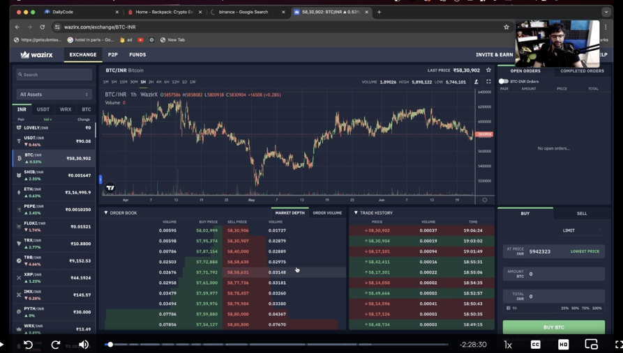

they have to suppoert basically 4 things history of the trade that you made, order book, chart, and the place where you can buy and sell the assets

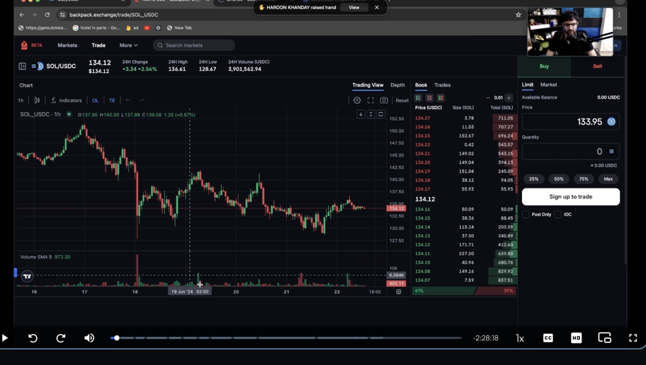

## Core concepts

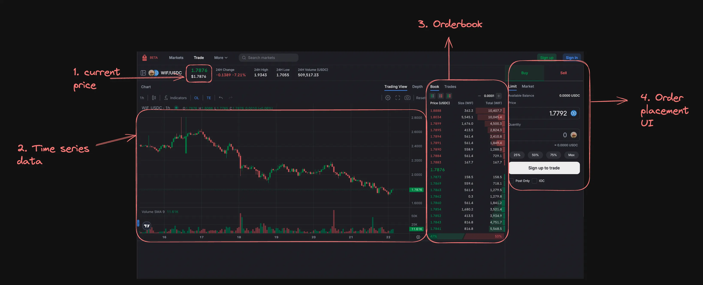

this is what the final ui looks like 

ok lets say you open any market like sol to usdc and opne any market 

you can come here 

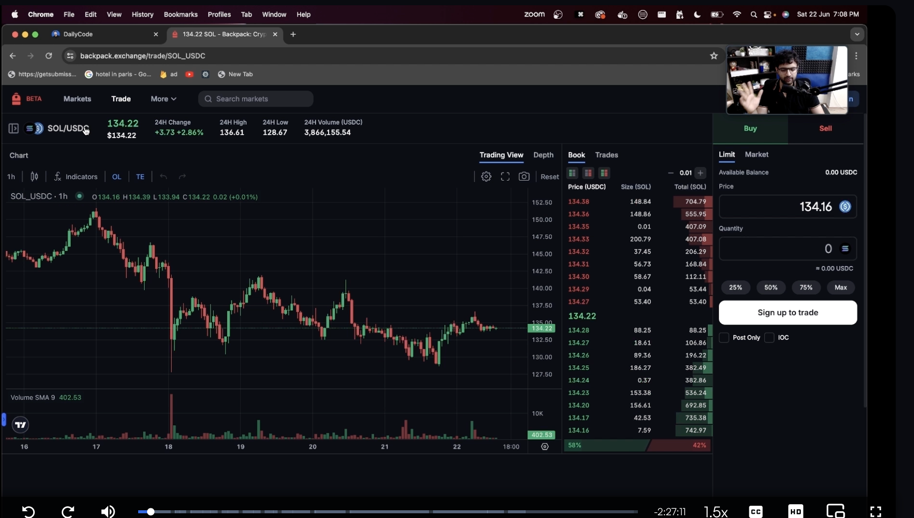

when we open this what we see we see the history of the prive of the solana how did solana go up and down in last lets say few days on this exchange this chart will be different for the every exchange thier might be a diff exchange where the solana is going up. 

now if you see the coinmarketcap it will show you the avg price from diff exchaeg 

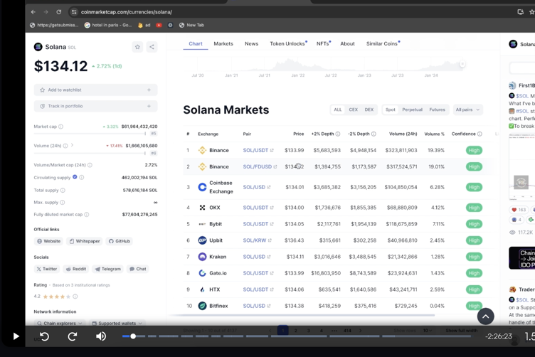

the second big jargon here is the order book. order book is the list of the people how are currently willing to buy and sell the asset. 

their are lot of people in the world who say i buy the solana at 134.22 at i am willing to buy 0.82 solana for this much money

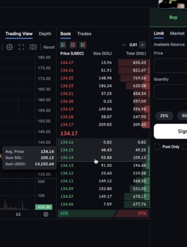

this is the orderbook all over the world who are willing to buy and sell the asset at different price

this are the maket makers theis are the people who are bit different they dont contain ui like tjis if we have to buy then we can go sign up and convert 

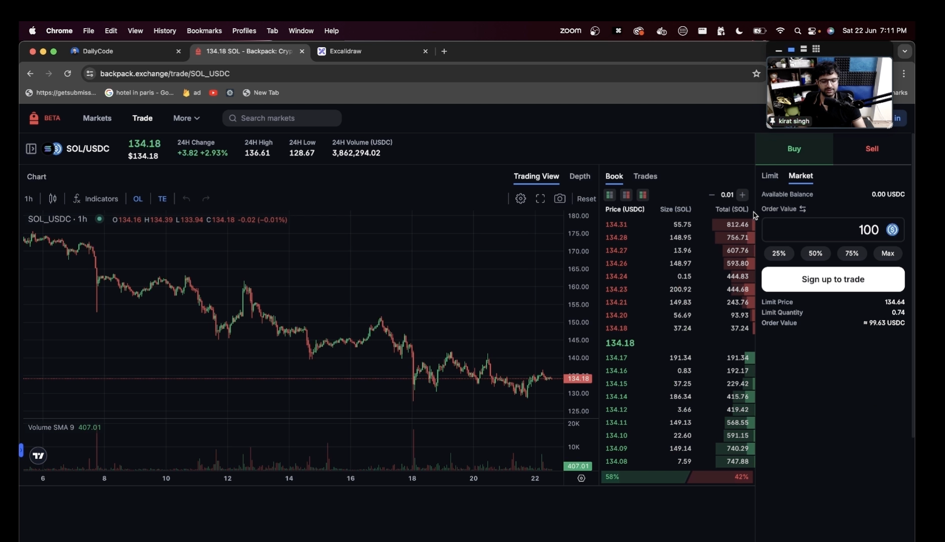

but market makers dont have this ui even if they have they will put the limit order not the market order. 

and last is the trade history this is the list of all the trade that has happened on this exchange

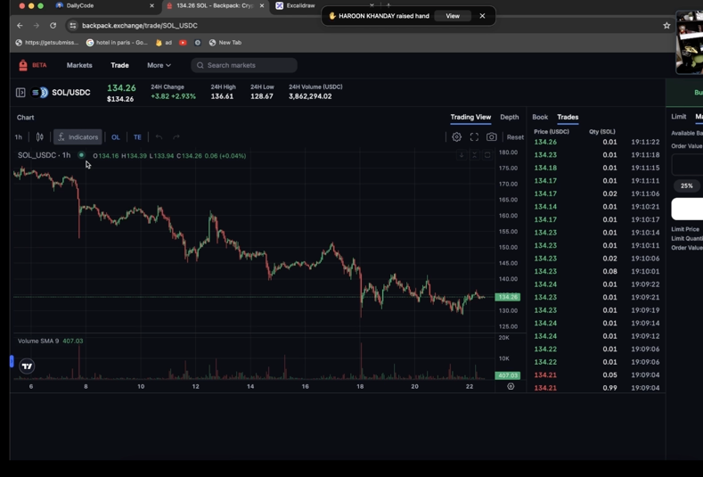

whatever the last swap has happened that would be the current price of the asset

1. Current Price
   A price feed which constantly gives you the current price of a stock (the last value at which it was traded)
2. Time series data
   A Database that stores the price of a stock over time.
3. Orderbook
   The current set of open orders that a user can come and trade on
4. Order placement UI
   A UI widget that a user can use to place an order

You build an exchange usually by copying over the API structure of an existing exchange - https://binance-docs.github.io/apidocs/spot/en/#new-order-trade

# Types of orders
There are two types of orders that you place on an exchange.
Market and Limit orders

1. Market Order
   any retail person placing an order is placing a market order. A market order is an order to buy or sell immediately at the current best available price.
   when you place a market order you are basically taking the liquidity from the order book

   I want to buy stocks of TATA for Rs 2000
   I want to buy ETH worth $200
   (market, price, side) is the only input to the API

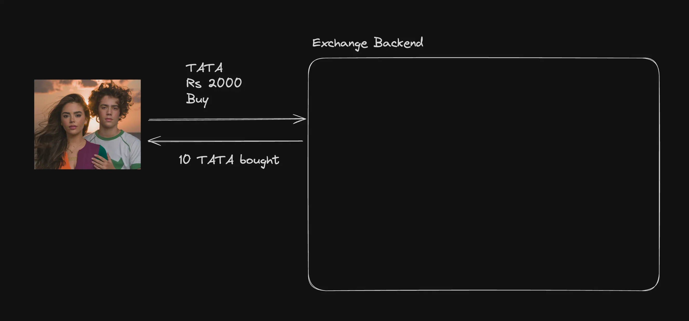

2. Limit Order
   A limit order is an order to buy or sell a stock at a specific price or better.
   when you place a limit order you are basically providing liquidity to the order book

   I want to buy 10 stocks of TATA at Rs 150 each
   I want to sell 0.5 ETH at $2500 each
   (limit, price, side) is the only input to the API

I will buy 1 stock of TATA at Rs 200/stock
(market, qty, price, side) is the input to the API

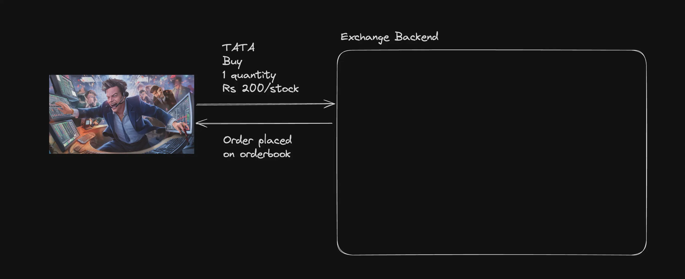


all the orders in the order books are the limit orders only 

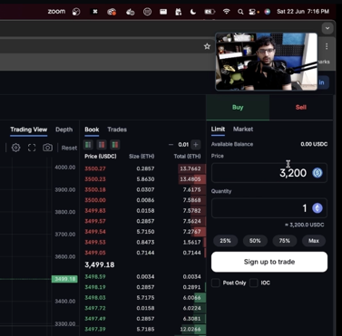

as you see market place people will calculate the fair price then they will sale on bit high price and buy on bit low price and make money on the spread

this project will show bunch of markets they will not be crypto markets they wll morebe close to zeoridha where you can see the indian stocks

order book are simple if you dont understand comeback to this video at https://app.100xdevs.com/courses/3/369/370 30.1 | Exchange Project - Part 1 at -2.15


Jargon
# markets
Whenever you trade, you swap one asset for another.
Every pair that you can trade is called a market.
For example -
ETH-USDC
TATA-INR
ETH-BTC (Usualy a combination of two markets, ETH-USDC and BTC-USDC)


# Base asset
The asset that is being traded (TATA).

# Quote asset
The asset it is being traded with.

# Orderbook
A list of currently available limit orders that people have placed. The more the number of orders, the more liquid the exchange is considered.

# Bid
A limit order of the following type -
I will buy 5 stocks of TATA for Rs 200/stock

# Ask
A limit order of the following type -
I will sell 5 stocks of TATA for Rs 201/stock

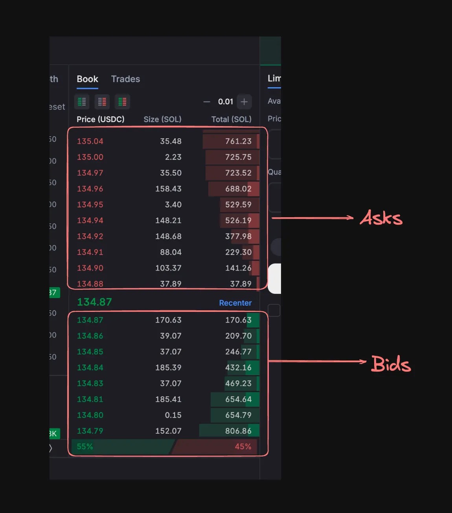

# Market makers
Big companies that keep the orderbook liquid (that have a lot of open orders on the orderbook)

--------

now lets fo theorught the arch

what all we requireed the chart the trade ordernook and current price 

now if we reverse engineer a backpack a bit then we will see that the one request is going to the depth api 

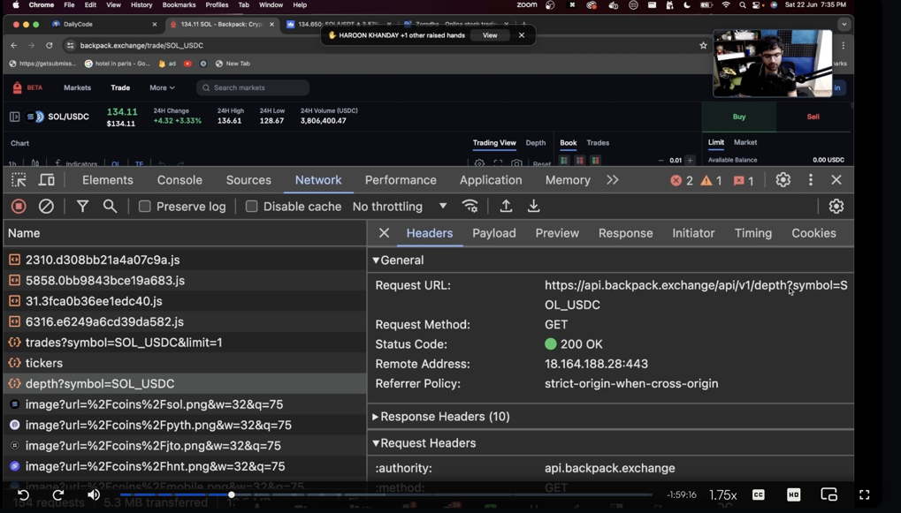

this is returning us a initially order book, order book changes very quickly it changes in real time so it would be gotten here by the websocket api but the initaly one will be come from this api 

now how is this built this is built by looking at other exchnages if we looks at the binance docs here
https://developers.binance.com/docs/binance-spot-api-docs

here you will findsomethign similar

the depth here 

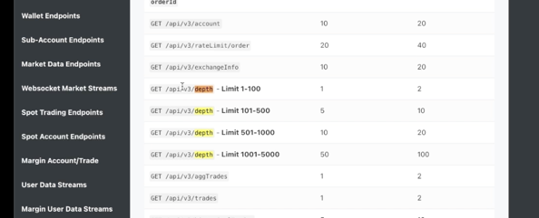

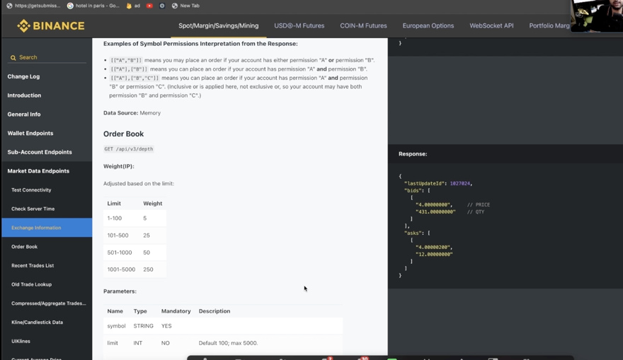

this will become same for the all becuase when traders want to trade they just have to chnage the url not the enndpoint 

so another endpoint would here be the trade endpoint here to see the recent trade thats happened

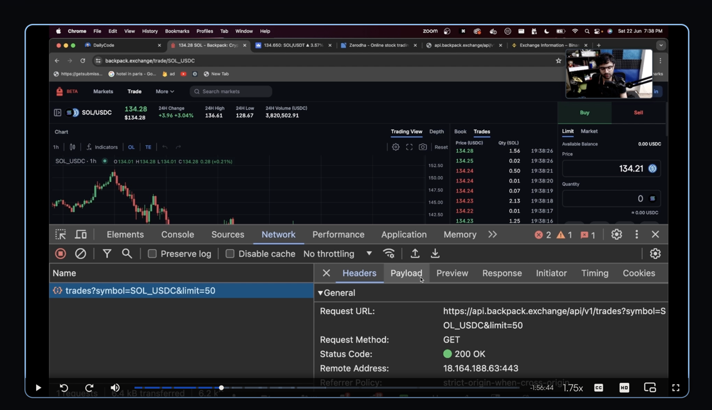

you can see it here you can see here the recent trade that happened 

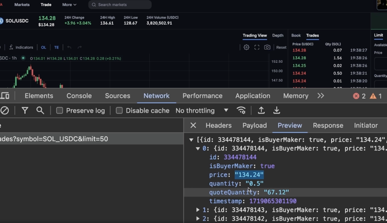

this is alos the real time but this is what fetched the intially

this charts also update in real time 

but intially you get the full history on endpoint like below 

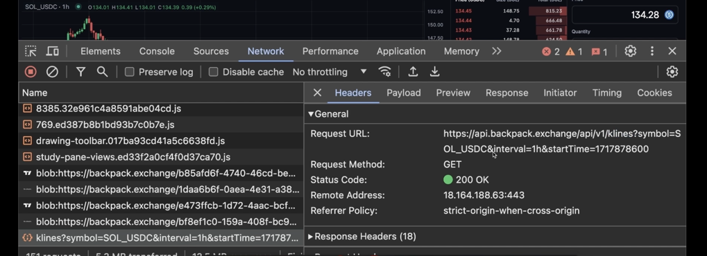

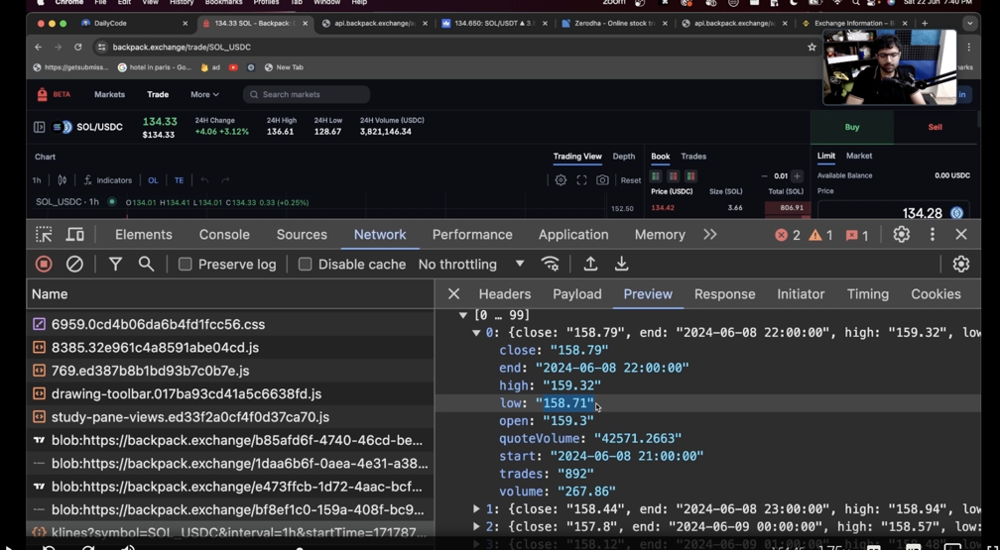

it shows somwthing like this that between the start ans end time the low and the hifgh price are this as per thta they creatre the candel 

now this are the points we have to support as well 

today we just create that user can buy or limit the order you can buy ot sell 

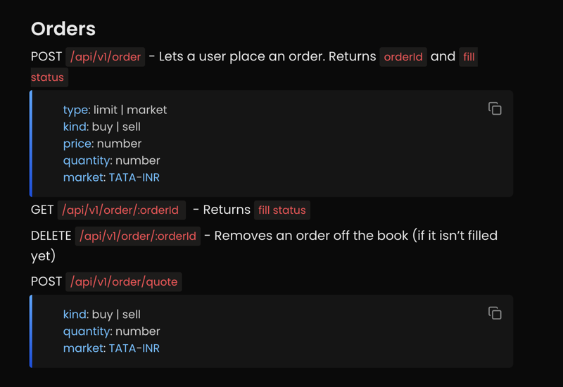

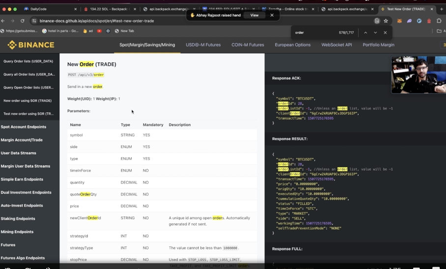

so before moving ahead lets understand the one more concept 
`All orders are limit orders`
their are 2 types of orders market and limit order 

limit orders are market makers and market orders are retailers 

lets say if i go to zerodha now and give them rs 10000 and tell give me all solaana you can give or tata stock you can give what problem can come 

lets say thier is a zerodha backend here and on the zerodha backend tata stock the order books is like this in the pic 

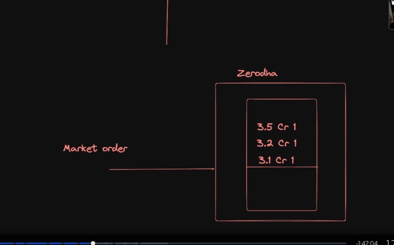

this is the sell price and this is a market order ( ki i will just tell you i will pay you this much pay whatever you want to pay i will tell that i am willing to spend 8 cr in return i am expecting 2.5 houses )
so something like this happens 

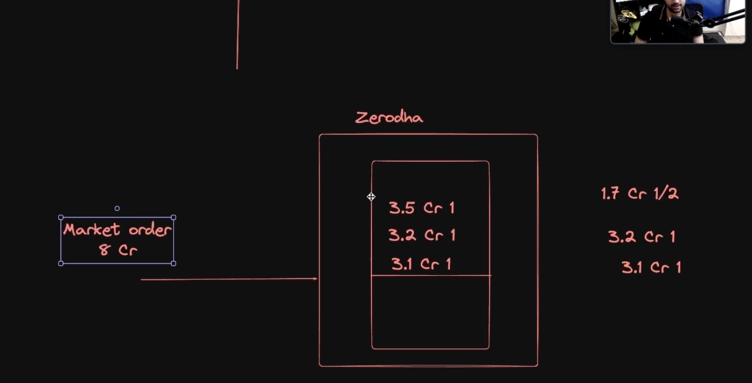

this is what you can hope but i didnot give a limit i didnot say that ki ek ghar ka dont pay more then 4 cr this is what we have not say so what can happens is as soon as i place the oder everyone will remove the order and thier will only 1 guy exist here that it will say i will sell the 1 house for the 8cr 

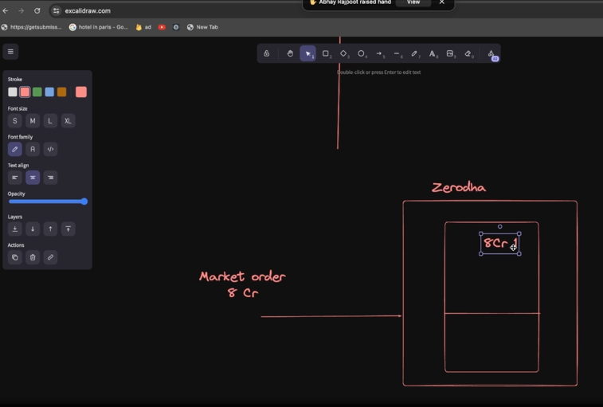

so if you place a market order and reallly dont care about the current price what will happens is the market will move by a lot and it will be forced to buy a single house for 8 cr 
even if we are placing the market order then lets sat we go here 

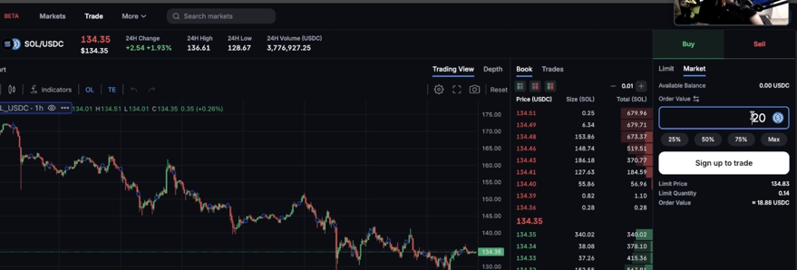

and say we want solana we see that price is 134 and i am willing to spend 135 in return i expect atleast 1 sol not the 0.1 so here i closed to 1 sol if i place the order and backend only gets so limits are alwyas their 

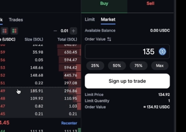

as you see they are the default vcalue this is the backend algo so this is auitomatically added this constraints by the exchange here and hence it become the limit order 

so here it make the quote that a person who spend 135 then what can be the fair price he get so here t he quote will done 

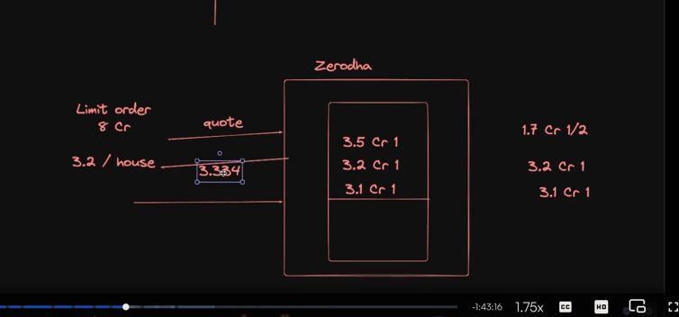

you never place a market order without a limit order

so over here aage jake we will see the architecture and the architecture we see ahead is samee for the newyork stock exchange how kirat now, he just know it. like in below image 


lets go through this fucking arch now

so until now we have build the application like this only thier is a vackend and theri is a requ come hit db and rep come and we sent to frontend 

order books are very different they are the core of what we are understadng

all this trades you see and books you see come from db but this order books doesnot exisit in the db orderbooks are in memeory they are just a variable in a rust golang and js process 

a single treaded process

even like a nyse exchange thier is a single process running where thier will be a variable like orderbooks and bids and asks 

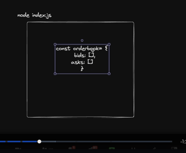

the bids and asks are not stored in the db at all it will be stored in the variable as process thier is a lots of down time to store the data like this what if the server crash the data goes away. this is not stored in the db becausw the orders bookls really needs to be very fast

so the question does it happens like you have place the order in m,emeory variable got udpated and you got the response hey things are done this is actuallt the fastest

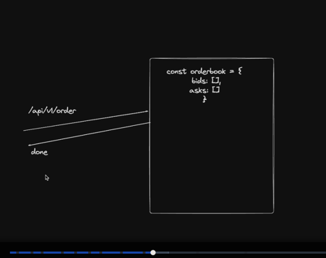

what is the downside of this? if the server ever dies then this variable got dies if you have orders they got removed so you need obvisionly somehting so that when the state restore they can be restored

so you have to store it somewhere

thier are few appraches how you can do this the approach that we will take is that 

the approach that we will take is that when the  order comes it comes to api server, what is api server? (what it will be for the backpack it will be the one which is api.backpack.exchange/v1/) and this is the main server whicih is scalable whereas order book is a single process. you cant scale it horizontally buit the api server can be scaled horizontally. now when the request comes rather then updating the in memeory variable here this server is not the main bt/usd orderbook this is a global server which has to talk with the other one this has too tell the order book that the new order has come pls process it and this commumoication happens via the queue as you see in pic 


this queue is your storage this is something which you pereisit forever ki yaar all the event happens in the exchange started went through this order book and hence this queue is your source of truth. if you ever want to re create the state 
if you ever want to re create the state of the ordere book you can go through all this even happens brginely and re create the current book that existed before the process die.
this will be the completely single threaded process 

any time an order happens a swap happens it will push to the another queue that this are the another event happens that i am able to fill half of the order and i am able to update the order bool bcs this order was paritally filled. 

this queue is what read from the webdocket server and let user know. 


order books are diff process js or java anything they match wethwe the order can be filled updated and that will be pushed to the queue then websocket will pull and show to the browser 

eventually when trades happen then also that filled or updated one queue is connected to the db also that when ever the trade happens it will update the db.

apart of this one another process whicih is the price poller that whenever the trade happens the price also got changes.

and thier are nunch of process which are subscribed to this event queue/

what all events has happened.

the orderbooks can talk back to the api server also.so the api server also is subscribed here to the queue

this is the general arch of any exchange

now lets look at the websocket server also 

the websocket server is built is also pure binance api 
you open the biannce and you can see incase you want the trade stream (trade happening in real time) the binance api says ki connect to our websocket server and send us 1 event looks like this in pic 

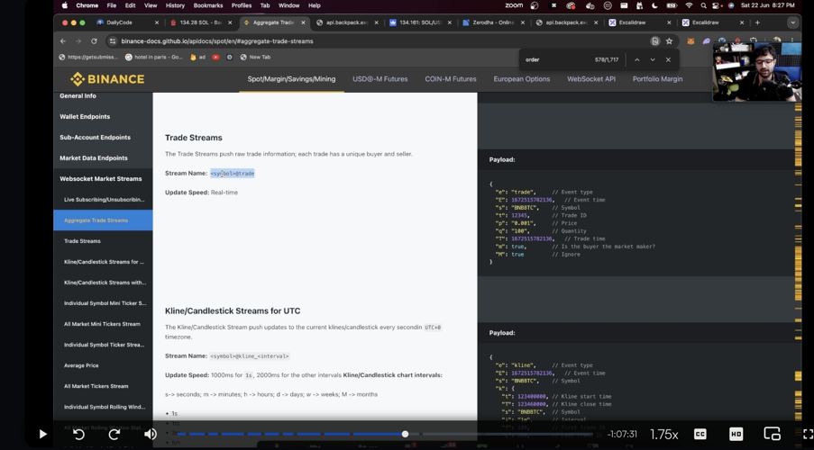

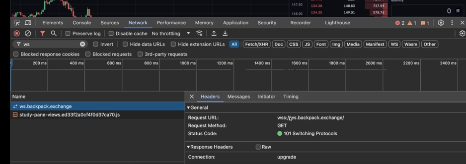

you can see here backpack stream

you can subscribe then they send data and The monet you change it you can unsubscribe

Websocket streams
The real time part of an app like this would be the following -
Current price
Current orderbook
Recent trades
Graph data


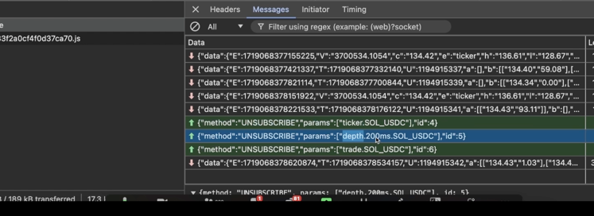

ok as of now we are going to follow this simple architecture today 

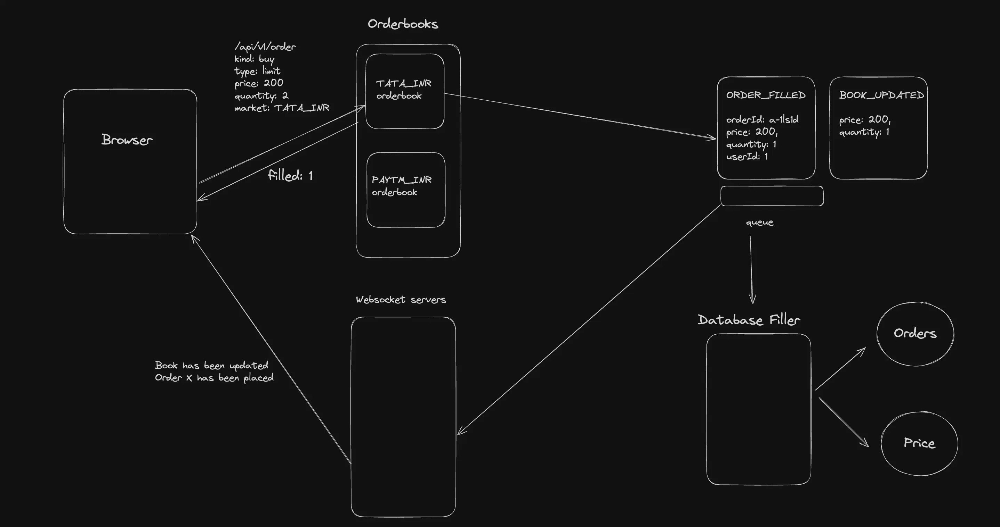

so here you will send the request and that server itself is a order book we will built the right one tommorow but i think i am nnot running this code or writing we will code tommorow means the new lect the entire end to end arch 

-------------------------

today this github link is just warmup code over here orderbook only required gooD math rest only is the fullstack

# Coding the API Server

* Initialize the project
```bash
mkdir orderbook-server
cd orderbook-server
npm init -y
npx tsc --init
npm install express redis uuid zod
npm install typescript ts-node @types/express @types/node @types/redis @types/uuid
```

* Update rootDir and outDir
* Create src/orderbook.ts
```ts

interface Order {
    price: number;
    quantity: number;
    orderId: string;
}

interface Bid extends Order {
    side: 'bid';
}

interface Ask extends Order {
    side: 'ask';
}

interface Orderbook {
    bids: Bid[];
    asks: Ask[];
}

export const orderbook: Orderbook = {
  bids: [
    
  ],
  asks: [
    
  ]
}

export const bookWithQuantity: {bids: {[price: number]: number}; asks: {[price: number]: number}} = {
    bids: {},
    asks: {}
}
```

* Create src/types.ts
```ts
import { z } from "zod";

export const OrderInputSchema = z.object({
  baseAsset: z.string(),
  quoteAsset: z.string(),
  price: z.number(),
  quantity: z.number(),
  side: z.enum(['buy', 'sell']),
  type: z.enum(['limit', 'market']),
  kind: z.enum(['ioc']).optional(),
});

```

* Create src/index.ts
```ts
import express from "express";
import { OrderInputSchema } from "./types";
import { orderbook, bookWithQuantity } from "./orderbook";

const BASE_ASSET = 'BTC';
const QUOTE_ASSET = 'USD';

const app = express();
app.use(express.json());

let GLOBAL_TRADE_ID = 0;

app.post('/api/v1/order', (req, res) => {
  const order = OrderInputSchema.safeParse(req.body);
  if (!order.success) {
    res.status(400).send(order.error.message);
    return;
  }

  const { baseAsset, quoteAsset, price, quantity, side, kind } = order.data;
  const orderId = getOrderId();

  if (baseAsset !== BASE_ASSET || quoteAsset !== QUOTE_ASSET) {
    res.status(400).send('Invalid base or quote asset');
    return;
  }

  const { executedQty, fills } = fillOrder(orderId, price, quantity, side, kind);

  res.send({
    orderId,
    executedQty,
    fills
  });
});

app.listen(3000, () => {
  console.log('Server is running on port 3000');
});


function getOrderId(): string {
    return Math.random().toString(36).substring(2, 15) + Math.random().toString(36).substring(2, 15);
}

interface Fill {
    "price": number,
    "qty": number,
    "tradeId": number,
}

function fillOrder(orderId: string, price: number, quantity: number, side: "buy" | "sell", type?: "ioc"): { status: "rejected" | "accepted"; executedQty: number; fills: Fill[] } {
    const fills: Fill[] = [];
    const maxFillQuantity = getFillAmount(price, quantity, side);
    let executedQty = 0;

    if (type === 'ioc' && maxFillQuantity < quantity) {
        return { status: 'rejected', executedQty: maxFillQuantity, fills: [] };
    }
    
    if (side === 'buy') {
        orderbook.asks.forEach(o => {
            if (o.price <= price && quantity > 0) {
                console.log("filling ask");
                const filledQuantity = Math.min(quantity, o.quantity);
                console.log(filledQuantity);
                o.quantity -= filledQuantity;
                bookWithQuantity.asks[o.price] = (bookWithQuantity.asks[o.price] || 0) - filledQuantity;
                fills.push({
                    price: o.price,
                    qty: filledQuantity,
                    tradeId: GLOBAL_TRADE_ID++
                });
                executedQty += filledQuantity;
                quantity -= filledQuantity;
                if (o.quantity === 0) {
                    orderbook.asks.splice(orderbook.asks.indexOf(o), 1);
                }
                if (bookWithQuantity.asks[price] === 0) {
                    delete bookWithQuantity.asks[price];
                }
            }
        });

        // Place on the book if order not filled
        if (quantity !== 0) {
            orderbook.bids.push({
                price,
                quantity: quantity - executedQty,
                side: 'bid',
                orderId
            });
            bookWithQuantity.bids[price] = (bookWithQuantity.bids[price] || 0) + (quantity - executedQty);
        }
    } else {
        orderbook.bids.forEach(o => {
            if (o.price >= price && quantity > 0) {
                const filledQuantity = Math.min(quantity, o.quantity);
                o.quantity -= filledQuantity;
                bookWithQuantity.bids[price] = (bookWithQuantity.bids[price] || 0) - filledQuantity;
                fills.push({
                    price: o.price,
                    qty: filledQuantity,
                    tradeId: GLOBAL_TRADE_ID++
                });
                executedQty += filledQuantity;
                quantity -= filledQuantity;
                if (o.quantity === 0) {
                    orderbook.bids.splice(orderbook.bids.indexOf(o), 1);
                }
                if (bookWithQuantity.bids[price] === 0) {
                    delete bookWithQuantity.bids[price];
                }
            }
        });

        // Place on the book if order not filled
        if (quantity !== 0) {
            orderbook.asks.push({
                price,
                quantity: quantity,
                side: 'ask',
                orderId
            });
            bookWithQuantity.asks[price] = (bookWithQuantity.asks[price] || 0) + (quantity);
        }
    }

    return {
        status: 'accepted',
        executedQty,
        fills
    }
}

function getFillAmount(price: number, quantity: number, side: "buy" | "sell"): number {
    let filled = 0;
    if (side === 'buy') {
        orderbook.asks.forEach(o => {
            if (o.price < price) {
                filled += Math.min(quantity, o.quantity);
            }
        });
    } else {
        orderbook.bids.forEach(o => {
            if (o.price > price) {
                filled += Math.min(quantity, o.quantity);
            }
        });
    }
    return filled;
}

```

https://github.com/100xdevs-cohort-2/week-30-orderbook-1/blob/main/week-1/day-1/src/orderbook.ts

-------------------------


### project starts

this written entire frontend already so just looks at it at 

/Users/kevin/Desktop/HSDX/Web-Dev-All-Prac/Projects/Exchange /week-30-orderbook-1/week-2

on thing is that the above arch we saw is only required for the crypto exchange bcs you have to support multiple order books

----

ok so here is the how backend is built

# What we did last week

1. Understood the jargon needed to build an exchange
   1. Base asset
   2. Quote asset
   3. Orderbooks
   4. Liquidity
   5. Limit orders
   6. Market orders
   7. KLines
2. Built the `frontend` for an exchange
   1. Proxied requests via https://exchange-proxy.100xdevs.com/api/v1/depth?symbol=SHFL_USDC
   2. Created a simple frontend which had `depth` , `orderbook`, `ticker`
   3. Assignment - Creating the `trades` tab on the frontend

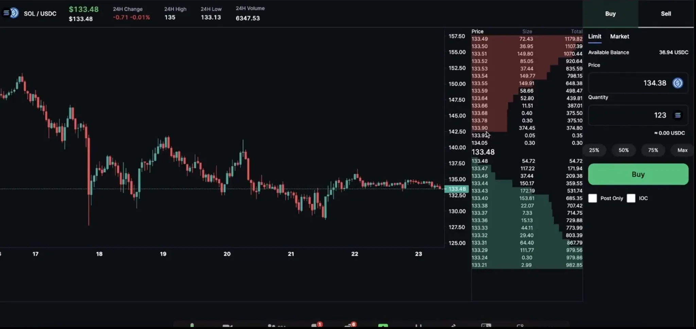

What we’re doing today

**Building the backend ourselves.**

### HTTP Endpoints

The endpoints we used last week were -

1. Get klines - https://exchange-proxy.100xdevs.com/api/v1/klines?symbol=SOL_USDC&interval=1h&startTime=1718957562&endTime=1719562362
2. Get depth - https://exchange-proxy.100xdevs.com/api/v1/depth?symbol=SHFL_USDC
3. Get Tickers - https://exchange-proxy.100xdevs.com/api/v1/tickers

### Websocket streaming

The streams we support include

1. trades@MARKET
2. depth@MARKET
3. ticker@MARKET

### Counter intuitive things -

1. Orderbook is in memory
2. User balances are in memory
3. Locking balances in memory

# Backend Architecture

We have the following services -

1. **API - An API Server the user sends HTTP requests to**
2. **Engine - Runs various market orderbooks, stores user balances in memory**
3. **Websocket - Websocket server that user subscribes to real time events from**
4. **DB Processor - Processes messages from the `Engine` and persists them in the DB**
5. Frontend - NextJS app (same as last week, only the URLs would change)
6. Market maker (mm) - Places random orders to keep the book liquid
7. Redis - Queue and pub sub
8. TimescaleDB - Creates buckets of klines based on price feed

There should ideally be a `primary database` like postgres as well that stores user info/orders/trades etc.

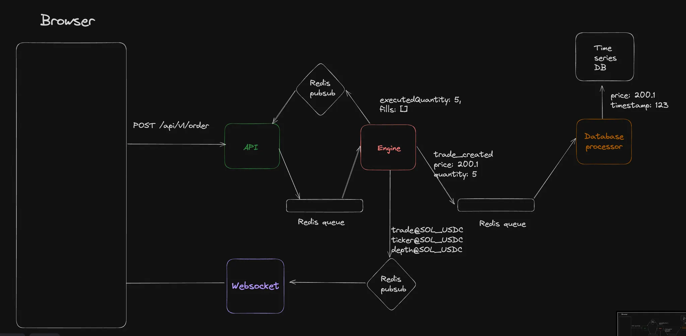

first requires is going to the api server. if it is the create order request or limit or market order it goes to the engine server(order book manager) to reach the engine server we are going to use redis queue the api server dont do any balance check and it is not even stored in db so the api server will check and forward the requwst to the engine server via redis queue.

this engine server will process the request one by one. so if multiple people are placing order you need to make sure that you sequentially handle the orders. you should not try any concurrency here. whenever you try to match the order if their are 100 order currently in the queue then you should not try to process it paralllely. so the engine wil pick things one by one and process it.

this engine maintain the users balances of every user it will maintain the order books which currently exists and wheneever new order comes if thier is a match happen it flip the balances of the users it will take usdc from one place  and give to another user and vice versa for the btc.

i think i understand over all arch so not wirting much  

so whenever you start undertsanding code start witht the engine probably 

here the websocket is only the bit difficult logic here 

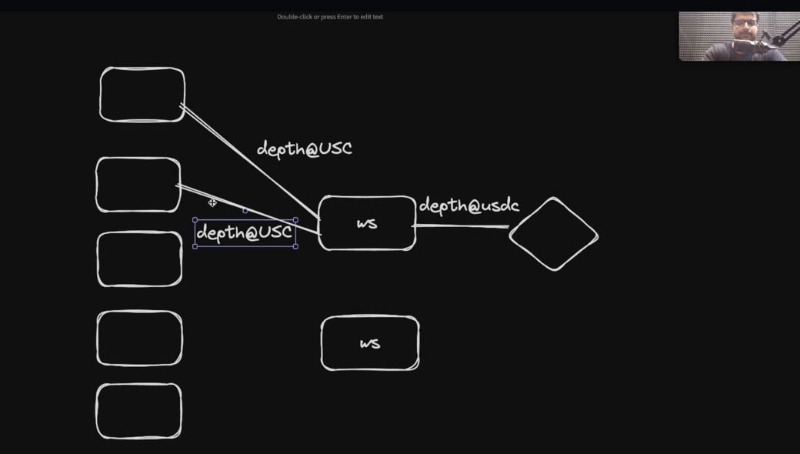

letsd say 2 user are connected to the single websocket one has subscribe for the depth of the usdc then do other also have to subscribe for the depth of usdc or not. the answer is not the first user has already subscribed so they they dont have to resubscribe.
but in this case lets say if user 1 leaves it make sure that it doesnot unsubsribe for the depth of usdc becuase user 2 is still there. finally when the last user leaves only then it should unsubscribe from the depth of usdc.

the engine will alwys produce here lets say trade happen then it publish to the pubsub. 

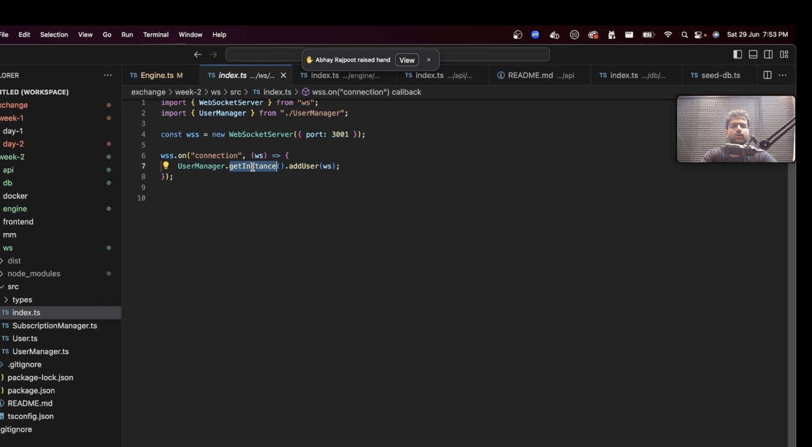

in websocket server code you will see `UserManager.getInstance().addUser(ws);` what does `getInstance()` means. It is singleton pattern. so there should be only 1 instance of the user manager. so whenever you call getInstance it will return the same instance. so that all the websocket connection can share the same user manager instance. so not multiple instance of user manager is created.

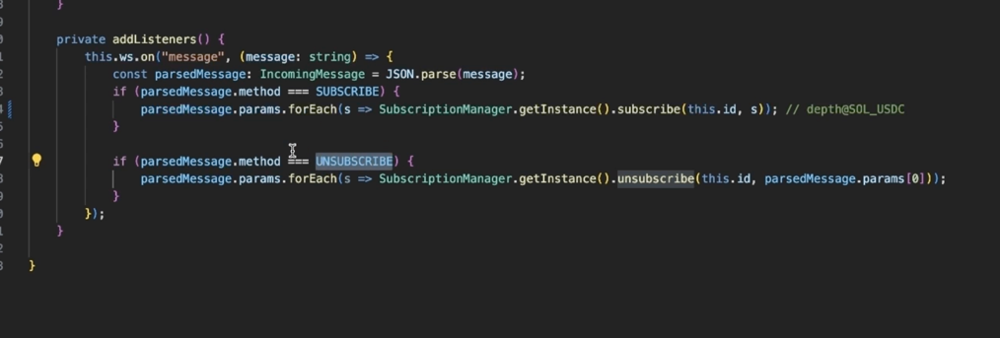

this is to subscribe and unsubscribe from the market and here the code of them.

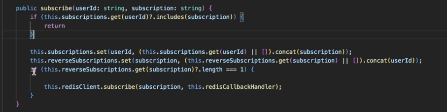

the logic is simple it says athat firszt it store something in memory then if the 1st user is theior then only it will subscribe. and with unsubscribe it will check if the last user is leaving only then it will unsubscribe.

now what to store in db. so the api server whatever happens ir push to the queere and it will be done by the db processor.


-----------------

# PUBSUB 

which is pending from long time 